# 三种代码编辑方式对比

- **python文件**

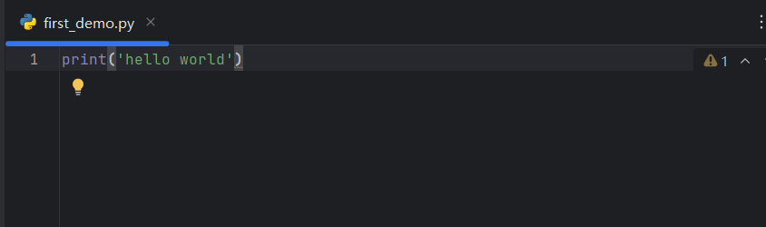

- **python控制台**

可以以任意行为块运行**shift+enter**，默认为单行

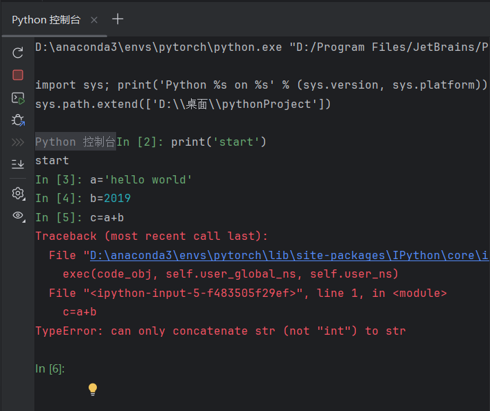

- **jupyter**

分块运行


总结：
	Python文件：通用，传播方便，更适用于大型项目，缺点就是需要从头开始运行。Python控制台：可以显示每个变量属性，缺点是不利于代码阅读和修改。Jupyter notebook：可以以任意行为块进行运行，同时利于代码阅读和修改，缺点是环境需要配置，比如安装Jupyter的一些package。
	可以交叉使用三者，主要会使用Python文件来存储一些代码信息，然后利用Python控制台进行小区域的调试，Jupyter notebook偶尔会完成小的项目或小的调试。

---

# pytorch加载数据

​	PyTorch的数据集和数据传递机制：Dataset负责建立索引到样本的映射，DataLoader负责以特定的方式从数据集中迭代的产生 一个个batch的样本集合。

**Dateset**：

​	提供一种方式获取数据及其lable

**Dateloader**：

​	为后面的网络提供不同的数据形式

## Dateset使用

```python
from torch.utils.data import Dataset
from PIL import Image
import os

class MyDataset(Dataset):
'''
在类的内部，使用 def 关键字来定义一个方法，与一般函数定义不同，类方法必须包含参数 self, 且为第一个参数，self 代表的是类的实例。
self 是一个指向类实例的引用，它在 __init__ 构造函数中用于初始化实例的属性。
通过使用 self，你可以在类的方法中访问和操作实例的属性，从而实现类的行为。
'''
    def __init__(self,root_dir,label_dir):
        self.root_dir=root_dir
        self.label_dir=label_dir
        self.path=os.path.join(self.root_dir,self.label_dir)
        self.img_path=os.listdir(self.path)

    def __getitem__(self, idx):
        img_name=self.img_path[idx]
        img_item_path=os.path.join(self.root_dir,self.label_dir,img_name)
        img=Image.open(img_item_path)
        label=self.label_dir
        return img,label

    def __len__(self):
        return len(self.img_path)

root_dir="dataset/train"
ans_label_dir="ants"
bees_label_dir="bees"
ants_dataset=MyDataset(root_dir,ans_label_dir)
bees_dataset=MyDataset(root_dir,bees_label_dir)
train_dataset=ants_dataset+bees_dataset
```

关于类的更多解释参考官方文档：https://docs.python.org/zh-cn/3.9/tutorial/classes.html

## Dataloader的使用

### DataLoader的参数说明

dataset (**==必需==)**: 用于加载数据的数据集，通常是torch.utils.data.Dataset的子类实例。

```python
# 创建自定义数据集实例
my_data = [1, 2, 3, 4, 5, 6, 7]
my_dataset = MyDataset(my_data)

# 使用DataLoader加载自定义数据集my_dataset
dataloader = DataLoader(dataset=my_dataset)
```

batch_size (可选): 每个批次的数据样本数。默认值为1。

```python
# 将批次大小设置为3，这意味着每个批次将包含3个数据样本。
dataloader = DataLoader(dataset=my_dataset, batch_size=3)

for data in dataloader:
	print(data)
```

shuffle (可选): 是否在每个周期开始时打乱数据。默认为False。如果设置为True，则在每个周期开始时，数据将被随机打乱顺序。

```python
# shuffle默认为False
dataloader = DataLoader(dataset=my_dataset, batch_size=3)

print("当shuffle=False时，运行结果如下：")
print("*" * 30)
for data in dataloader:
    print(data)
print("*" * 30)

dataloader = DataLoader(dataset=my_dataset, batch_size=3, shuffle=True)

print("当shuffle=True时，运行结果如下：")
print("*" * 30)
for data in dataloader:
    print(data)
print("*" * 30)
```

drop_last (可选): 如果数据集大小不能被批次大小整除，是否丢弃最后一个不完整的批次。默认为False。

```python
# drop_last默认为False
dataloader = DataLoader(dataset=my_dataset, batch_size=3)

print("当drop_last=False时，运行结果如下：")
print("*" * 30)
for data in dataloader:
    print(data)
print("*" * 30)

dataloader = DataLoader(dataset=my_dataset, batch_size=3, drop_last=True)

print("当drop_last=True时，运行结果如下：")
print("*" * 30)
for data in dataloader:
    print(data)
print("*" * 30)
```

sampler (可选): 定义从数据集中抽取样本的策略。如果指定，则忽略shuffle参数。如果设置为`True`，则在每个周期开始时，数据将被随机打乱顺序。

```python
from torch.utils.data import SubsetRandomSampler

# 创建一个随机抽样器，只选择索引为偶数的样本 【索引从0开始~】
sampler = SubsetRandomSampler(indices=[i for i in range(0, len(my_dataset), 2)])
dataloader = DataLoader(dataset=my_dataset, sampler=sampler)

for data in dataloader:
    print(data)
```

batch_sampler (可选): 与sampler类似，但一次返回一个批次的索引。不能与batch_size、shuffle和sampler同时使用。

```python
from torch.utils.data import BatchSampler
from torch.utils.data import SubsetRandomSampler

# 创建一个随机抽样器，只选择索引为偶数的样本 【索引从0开始~】
sampler = SubsetRandomSampler(indices=[i for i in range(0, len(my_dataset), 2)])

# 创建一个批量抽样器，每个批次包含2个样本
batch_sampler = BatchSampler(sampler, batch_size=2, drop_last=True)
dataloader = DataLoader(dataset=my_dataset, batch_sampler=batch_sampler)

for data in dataloader:
    print(data)
```

collate_fn (可选): 如何将多个数据样本整合成一个批次。通常不需要指定。

---

# Tensorboard的使用

原文链接：https://blog.csdn.net/qq_41656402/article/details/131123121

​	TensorBoard 是一组用于**数据可视化**的工具。它包含在流行的开源机器学习库 Tensorflow 中。TensorBoard 的主要功能包括：

1. 可视化模型的网络架构
2. 跟踪模型指标，如损失和准确性等
3. 检查机器学习工作流程中权重、偏差和其他组件的直方图
4. 显示非表格数据，包括图像、文本和音频
5. 将高维嵌入投影到低维空间

## 配置TensorBoard

​	使用PyTorch时，通过`torch.utils.tensorboard`模块来使用TensorBoard。首先，导入`SummaryWriter`来记录事件：

```python
from torch.utils.tensorboard import SummaryWriter
 
# 初始化SummaryWriter
writer = SummaryWriter('runs/experiment_name')
```

​	然后，在训练循环中，使用`writer.add_scalar`等方法来记录信息，例如损失和准确率：

```
for epoch in range(num_epochs):
    # 训练模型...
    loss = ...
    accuracy = ...
    
    # 记录损失和准确率
    writer.add_scalar('Loss/train', loss, epoch)
    writer.add_scalar('Accuracy/train', accuracy, epoch)
 
# 关闭writer
writer.close()
```

## Tensorboard的启动

​	要启动 TensorBoard，打开终端或命令提示符并运行：

1. 首先进入你运行代码的环境
2. 然后使用下面这条命令，路径是log文件的？上一个？目录： `tensorboard --logdir=runs`

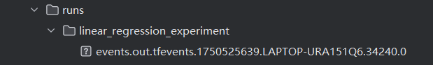

## 案例演示

```python
import torch
import torch.nn as nn
import numpy as np
from torch.utils.tensorboard import SummaryWriter


# 定义模型
class LinearRegressionModel(nn.Module):
    def __init__(self):
        super(LinearRegressionModel, self).__init__()
        self.linear = nn.Linear(1, 1)  # 输入和输出都是1维

    def forward(self, x):
        return self.linear(x)


# 准备数据
x_train = np.array([[3.3], [4.4], [5.5], [6.71], [6.93], [4.168],
                    [9.779], [6.182], [7.59], [2.167],
                    [7.042], [10.791], [5.313], [7.997], [3.1]], dtype=np.float32)

y_train = np.array([[1.7], [2.76], [2.09], [3.19], [1.694], [1.573],
                    [3.366], [2.596], [2.53], [1.221],
                    [2.827], [3.465], [1.65], [2.904], [1.3]], dtype=np.float32)

x_train = torch.from_numpy(x_train)
y_train = torch.from_numpy(y_train)

# 初始化模型
model = LinearRegressionModel()

# 损失和优化器
criterion = nn.MSELoss()
optimizer = torch.optim.SGD(model.parameters(), lr=0.01)

# 初始化SummaryWriter
writer = SummaryWriter('runs/linear_regression_experiment')

# 训练模型
num_epochs = 100
for epoch in range(num_epochs):
    # 转换为tensor
    inputs = x_train
    targets = y_train

    # 前向传播
    outputs = model(inputs)
    loss = criterion(outputs, targets)

    # 反向传播和优化
    optimizer.zero_grad()
    loss.backward()
    optimizer.step()

    # 记录损失
    writer.add_scalar('Loss/train', loss.item(), epoch)

    if (epoch + 1) % 10 == 0:
        print(f'Epoch [{epoch + 1}/{num_epochs}], Loss: {loss.item():.4f}')

# 关闭SummaryWriter
writer.close()
```

效果图：

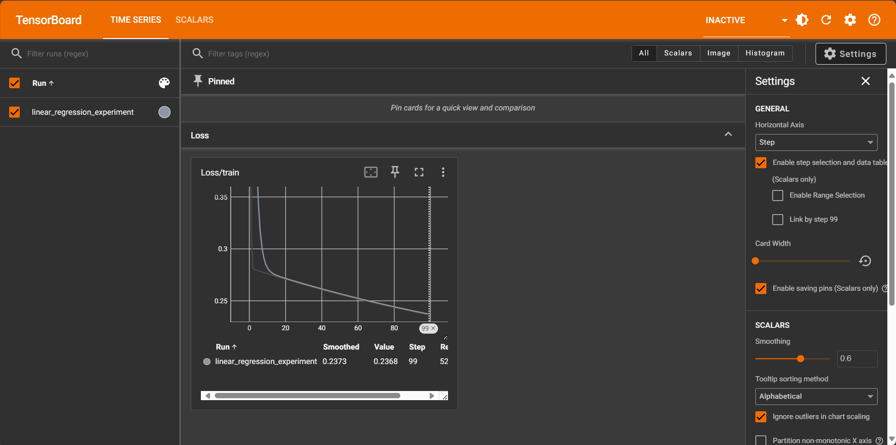

---

# Transforms的使用

本质是一个transforms.py工具箱，**碰到不会使用的，多看看官方文档。注意需要用的哪些参数，以及参数的类型**

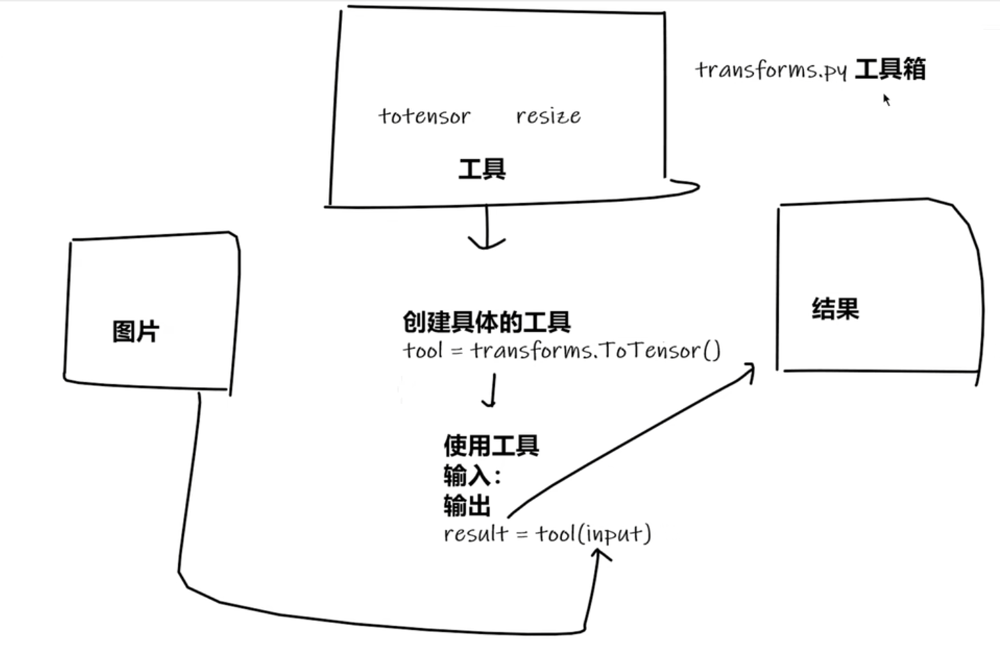

## tensor数据类型

通过transforms.ToTensor()去看两个问题

1. transforms如何使用
2. 为什么需要tensor数据类型

```python
class ToTensor:
    """Convert a PIL Image or ndarray to tensor and scale the values accordingly.

    This transform does not support torchscript.

    Converts a PIL Image or numpy.ndarray (H x W x C) in the range
    [0, 255] to a torch.FloatTensor of shape (C x H x W) in the range [0.0, 1.0]
    if the PIL Image belongs to one of the modes (L, LA, P, I, F, RGB, YCbCr, RGBA, CMYK, 1)
    or if the numpy.ndarray has dtype = np.uint8

    In the other cases, tensors are returned without scaling.

    .. note::
        Because the input image is scaled to [0.0, 1.0], this transformation should not be used when
        transforming target image masks. See the `references`_ for implementing the transforms for image masks.

    .. _references: https://github.com/pytorch/vision/tree/main/references/segmentation
    """

    def __init__(self) -> None:
        _log_api_usage_once(self)

    def __call__(self, pic):
        """
        Args:
            pic (PIL Image or numpy.ndarray): Image to be converted to tensor.

        Returns:
            Tensor: Converted image.
        """
        return F.to_tensor(pic)

    def __repr__(self) -> str:
        return f"{self.__class__.__name__}()"
```

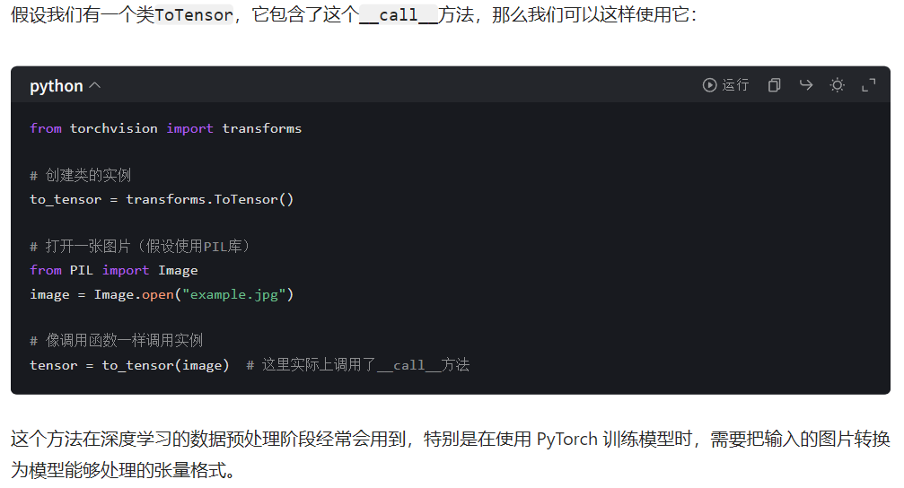

==上面这个其实都属于python基础了==

## 常见的Transforms

**PIL : Image.open()；tensor : ToTensor()；ndarrays: cv.imread()**

- ToTensor() ：将图片对象类型转为 tensor

- Normalize() ：对图像像素进行归一化计算

- Resize():重新设置 PIL Image的大小,返回也是PIL Image格式

Compose(): 输入为 transforms类型参数的列表，即`Compose([transforms参数1, transforms参数2], ...)`，目的是将几个 transforms操作打包成一个，比如要先进行大小调整，然后进行归一化计算，返回tensor类型，则可以将 ToTensor、Normalize、Resize，按操作顺序输入到Compose中。
示例代码：

```python
from PIL import Image
from torch.utils.tensorboard import SummaryWriter
from torchvision import transforms
import os

root_path = "hymenoptera_data/train/ants"
img_name = "7759525_1363d24e88.jpg"
img_path = os.path.join(root_path,img_name)
img = Image.open(img_path)

writer = SummaryWriter("logs")

# ToTensor
trans_totensor = transforms.ToTensor() # instantiation
img_tensor = trans_totensor(img)
writer.add_image("Tensor", img_tensor)

# Normalize
print(img_tensor[0][0][0])
trans_norm = transforms.Normalize([0.5,0.5,0.5],[0.5,0.5,0.5])
img_norm = trans_norm(img_tensor)
print(img_norm[0][0][0])
writer.add_image("Normalize", img_norm)

#Resize
print(img.size)
trans_resize = transforms.Resize((512,512))
img_resize = trans_resize(img) # return type still is PIL image
img_resize = trans_totensor(img_resize)
writer.add_image("Resize", img_resize)

# Compose - resize -2
trans_resize_2 = transforms.Resize(512)
tran_compose = transforms.Compose([trans_resize_2, trans_totensor])
img_resize2 = tran_compose(img)
writer.add_image("Compose", img_resize2)

writer.close()
```

---

# torchvision中的数据集的使用

代码示例：

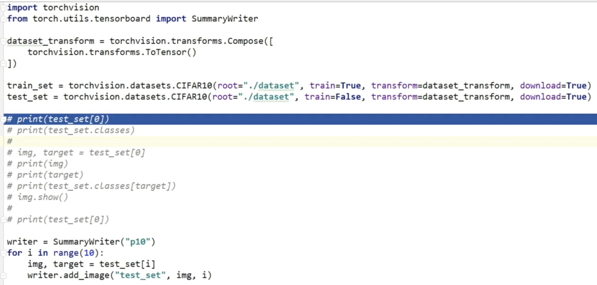

运行结果：大猩猩？bushi


---

# 神经网络

## 基本骨架-nn.module的使用

```python
import torch
from torch import nn

class Tudui(nn.Module):
    def __init__(self):
        super(Tudui, self).__init__()

    def forward(self, input):
        output = input+1
        return output

tudui = Tudui()
x=torch.tensor(1.0)
output=tudui(x)
print(output)
```

## 卷积操作

conv2d（这里的2就代表二维）

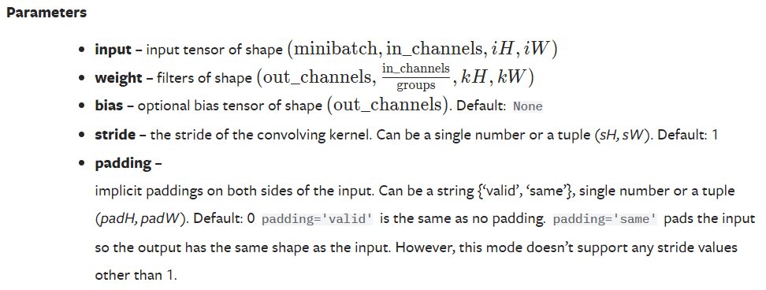

```python
import torch
import torch.nn.functional as F

input=torch.tensor([[1,2,0,3,1],
                    [0,1,2,3,1],
                    [1,2,1,0,0],
                    [5,2,3,1,1],
                    [2,1,0,1,1]])

kernel=torch.tensor([[1,2,1],
                     [0,1,0],
                     [2,1,0]])

input=torch.reshape(input,(1,1,5,5))
kernel=torch.reshape(kernel,(1,1,3,3)) #卷积核
'''
1. input
作用：定义输入张量的形状要求，是卷积操作的数据来源。
形状格式：(minibatch, in_channels, iH, iW)
minibatch：批次大小，即一次输入多少张（或多少个样本）图像 / 特征图，体现并行计算的样本数量。
in_channels：输入张量的通道数。比如 RGB 图像是 3 通道（in_channels=3 ），灰度图是 1 通道（in_channels=1 ），也可以是卷积层中间传递的特征图通道数。
iH：输入张量的高度（height）维度大小。
iW：输入张量的宽度（width）维度大小。
'''

'''
2. weight
作用：卷积核（滤波器，filters）的参数，是模型训练中需要学习更新的核心权重，决定了卷积层提取什么特征。
形状格式：(out_channels, in_channels/groups, kH, kW)
out_channels：输出张量的通道数，即要生成多少组特征图，体现想提取多少种不同类型的特征。
in_channels/groups：和分组卷积（grouped convolution）相关。若 groups=1（默认情况，常规卷积），则就是 in_channels ；若分组（比如 groups=in_channels 就是深度可分离卷积的一种情况 ），会拆分通道做分组计算，减少参数量。
kH：卷积核的高度（kernel height），比如常见的 3 代表 3×3 的卷积核高度维度。
kW：卷积核的宽度（kernel width），和 kH 搭配定义卷积核尺寸（如 3×3、5×5 等 ）。
'''
print(input.shape)
print(kernel.shape)

'''
4. stride
作用：控制卷积核在输入张量上 “滑动步长”，影响输出特征图的尺寸和计算效率。
格式：可以是单个数字（如 stride=2 ），也可以是元组 (sH, sW)（如 stride=(2,1) ，分别控制高度、宽度方向步长 ），默认值是 1。
'''

'''
5. padding
作用：在输入张量的边缘 “填充” 额外值（通常填 0 ，也有其他模式但默认 0 ），用来控制输出特征图的尺寸，避免边缘信息丢失，或让输出和输入尺寸匹配。
如 padding=1 ，表示在输入的 高度、宽度方向的上下 / 左右都填充 1 层（即对 iH、iW 维度各填充 1 ）。
'''
output=F.conv2d(input,kernel,stride=1)
print(output)

output2=F.conv2d(input,kernel,stride=2)
print(output2)

output3=F.conv2d(input,kernel,stride=1,padding=1)
print(output3)
```

## 卷积层

卷积层的作用是提取输入图片中的信息，这些信息被称为图像特征，这些特征是由图像中的每个像素通过组合或者独立的方式所体现，比如图片的纹理特征，颜色特征。

```python
import torch
import torchvision
from torch import nn
from torch.nn import Conv2d
from torch.utils.data import DataLoader
from torch.utils.tensorboard import SummaryWriter

dataset=torchvision.datasets.CIFAR10(root='./data', train=False,transform=torchvision.transforms.ToTensor(), download=True)

dataloader=DataLoader(dataset,batch_size=64)

class Tudui(nn.Module):
    def __init__(self):
        super(Tudui,self).__init__()
        self.conv1=Conv2d(3,6,3,stride=1,padding=0)  #！！！

    def forward(self,x):
        x=self.conv1(x)
        return x

tudui=Tudui()

writer=SummaryWriter(log_dir='./logs')

step=0
for data in dataloader:
    imgs,targets=data
    output=tudui(imgs)
    #print(imgs.shape)
    #print(output.shape)
    writer.add_images('iuput',imgs,step)
    
    output=torch.reshape(output,(-1,3,30,30))
    writer.add_images('output',output,step)
    step+=1

writer.close()
```

## 池化层

​	它实际上是一种形式的降采样。有多种不同形式的非线性池化函数，而其中“最大池化（Max pooling）”是最为常见的。它是将输入的图像划分为若干个矩形区域，对每个子区域输出最大值。直觉上，这种机制能够有效地原因在于，在发现一个特征之后，它的精确位置远不及它和其他特征的相对位置的关系重要。池化层会不断地减小数据的空间大小，因此参数的数量和计算量也会下降，这在一定程度上也控制了过拟合。通常来说，CNN的卷积层之间都会周期性地插入池化层。


```python
import torch
import torchvision
from torch import nn
from torch.nn import MaxPool2d
from torch.utils.data import DataLoader
from torch.utils.tensorboard import SummaryWriter

dataset=torchvision.datasets.CIFAR10(root='./data', train=False, download=True,transform=torchvision.transforms.ToTensor())

dataloader=DataLoader(dataset,batch_size=64)

class Tudui(nn.Module):
    def __init__(self):
        super(Tudui, self).__init__()
        self.maxpool1 = MaxPool2d(kernel_size=3, ceil_mode=False)
        #默认stride=kernel_size

    def forward(self, x):
        output = self.maxpool1(x)
        return output

tudui = Tudui()

writer=SummaryWriter('logs')
step=0
for data in dataloader:
    imgs,targets=data
    writer.add_images('input',imgs,step)
    output=tudui(imgs)
    writer.add_images('output',output,step)
    step+=1

writer.close()
```

## 非线性激活函数

Relu（）

sigmoid（）

## 线性层及其他层介绍

线性层也叫全连接层或密集层，全连接层的每一个节点都和上一层所有的节点相连，从而把之前提取到的特征综合起来。

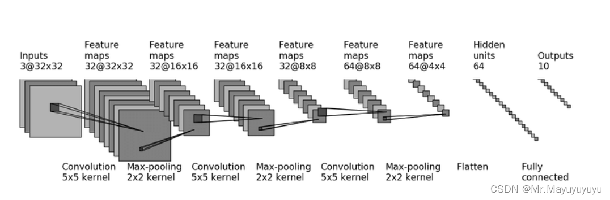

```python
class Tudui(nn.Module):
    def __init__(self):
        super(Tudui, self).__init__()
        self.conv1 = Conv2d(3,32,5,padding=2)
        self.maxpool1=MaxPool2d(2)
        self.conv2 = Conv2d(32,32,5,padding=2)
        self.maxpool2=MaxPool2d(2)
        self.conv3 = Conv2d(32,64,5,padding=2)
        self.maxpool3=MaxPool2d(2)
        self.flatten = Flatten()
        self.linear1=Linear(1024,64)
        self.linear2=Linear(64,10)
    def forward(self,x):
        x = self.conv1(x)
        x = self.maxpool1(x)
        x = self.conv2(x)
        x = self.maxpool2(x)
        x = self.conv3(x)
        x = self.maxpool3(x)
        x = self.flatten(x)
        x = self.linear1(x)
        x = self.linear2(x)
        return x
```

**可以利用sequential进行封装，使得代码更加简洁**

## 损失函数与反向传播

- 均方误差

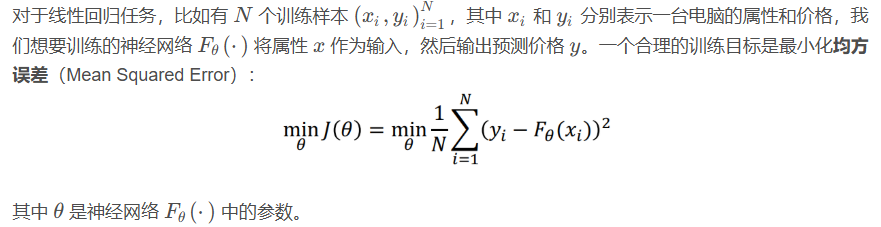

- 交叉熵

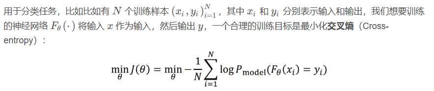

反向传播

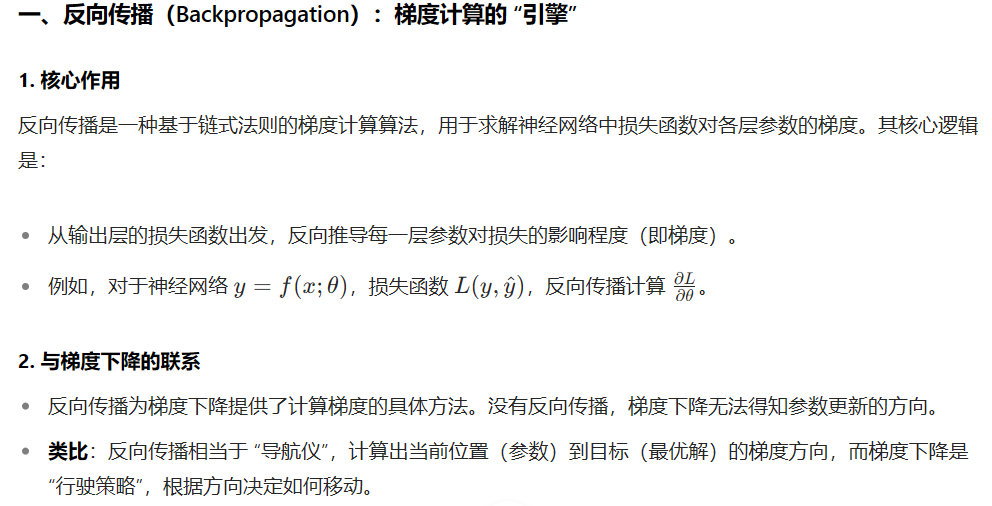

## 优化器


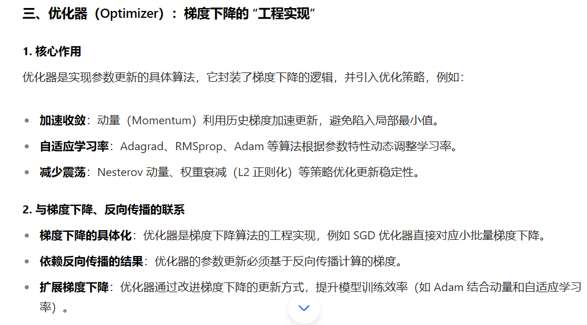

先清零，计算反向传播，调用优化器，循环往复

## 现有网络模型的使用与修改

```python
import torchvision
from torch import nn

vgg16_true=torchvision.models.vgg16(pretrained=True)
vgg16_false=torchvision.models.vgg16(pretrained=False)

vgg16_true.classifier.add_module('add_linear',nn.Linear(in_features=1000,out_features=10))
print(vgg16_true)

vgg16_false.classifier[6]=nn.Linear(in_features=4096,out_features=10)
print(vgg16_false)
```

## 网络模型的保存与读取

- 保存方式1

```python
import torch
import torchvision

vgg16 = torchvision.models.vgg16(pretrained=False)
# 保存方式1 后缀最好是.pth，可以同时保存模型及参数
torch.save(vgg16, "vgg16_method1.pth")
```

- 读取方式1

```py
import torch
import torchvision

# 方式1->保存方式1，加载模型
model = torch.load("vgg16_method1.pth")
print(model)
```

- 保存方式2

```py
import torch
import torchvision

vgg16 = torchvision.models.vgg16(pretrained=False)

# 保存方式2，把vgg16的状态（参数）保存为字典，没有结构 【官方推荐】因为空间小
torch.save(vgg16.state_dict(), "vgg16_method2.pth")
```

- 读取方式2

```python
import torch
import torchvision

# 方式2，加载模型
vgg16 = torchvision.models.vgg16(pretrained=False)
# 参数和结构放一起
vgg16.load_state_dict(torch.load("vgg16_method2.pth"))
# model = torch.load("vgg16_method2.pth")
print(vgg16)
```

注意，有个陷阱，如果你要加载自己的模型，需要将模型那个类的定义导进来（可以通过import方法，一般我们会单独创建一个文件夹，保存所有模型的定义），不然报错

# 完整训练套路

```python
import torch
import torchvision
from torch import nn

from torch.utils.data import DataLoader
from torch.utils.tensorboard import SummaryWriter
import time
#from model import *

#定义训练的设备
device=torch.device("cuda:1" if torch.cuda.is_available() else "cpu")
#准备数据集
train_data=torchvision.datasets.CIFAR10(root='../data', train=True, transform=torchvision.transforms.ToTensor(),download=True)
test_data=torchvision.datasets.CIFAR10(root='../data', train=False, transform=torchvision.transforms.ToTensor(),download=True)

#长度
train_data_size=len(train_data)
test_data_size=len(test_data)

print("训练数据集长度为：{}".format(train_data_size))
print("测试数据集长度为：{}".format(test_data_size))

#加载
train_dataloader=DataLoader(train_data, batch_size=64)
test_dataloader=DataLoader(test_data, batch_size=64)

#创建网络
class Tudui(nn.Module):
    def __init__(self):
        super(Tudui, self).__init__()
        self.model=nn.Sequential(
            nn.Conv2d(3, 32, 5,1, padding=2),
            nn.MaxPool2d(2),
            nn.Conv2d(32, 32, 5,1, padding=2),
            nn.MaxPool2d(2),
            nn.Conv2d(32, 64, 5, 1,padding=2),
            nn.MaxPool2d(2),
            nn.Flatten(),
            nn.Linear(1024, 64),
            nn.Linear(64, 10)
        )

    def forward(self,x):
        x = self.model(x)
        return x
tudui=Tudui()
#cuda，可以通过if函数判断
tudui.to(device)

#损失函数
loss_fn=nn.CrossEntropyLoss()
loss_fn.to(device)

#优化器
learing_rate=1e-2
optimizer=torch.optim.SGD(tudui.parameters(), lr=learing_rate)


#设置训练网络的一些参数
#记录训练次数
total_train_step=0
#记录测试次数
total_test_step=0
#训练的轮数
epoch=10

#添加tensorboard
writer=SummaryWriter(log_dir='../logs')
start_time=time.time()
for i in range(epoch):
    print("------第{}轮训练开始------".format(i+1))

    #训练步骤开始
    tudui.train()
    for data in train_dataloader:
        imgs,targets=data
        #cuda
        imgs=imgs.to(device)
        targets=targets.to(device)
        outputs=tudui(imgs)
        loss=loss_fn(outputs,targets)

        #优化器优化模型
        optimizer.zero_grad()
        loss.backward()
        optimizer.step()

        total_train_step+=1

        if total_train_step%100==0:
            end_time=time.time()
            print(end_time-start_time)
            print('训练次数：{}，loss：{}'.format(total_train_step,loss.item()))
            writer.add_scalar('train_loss',loss.item(),total_train_step)

    #测试步骤开始
    tudui.eval()
    total_test_loss=0
    total_accuracy=0
    with torch.no_grad():
        for data in test_dataloader:
            imgs,targets=data
            #cuda
            imgs=imgs.to(device)
            targets=targets.to(device)
            outputs=tudui(imgs)
            loss=loss_fn(outputs,targets)
            total_test_loss=total_test_loss+loss.item()
            accuracy=(outputs.argmax(1)==targets).sum()
            total_accuracy=total_accuracy+accuracy

    print("整体测试集上的loss：{}".format(total_test_loss))
    print("整体测试集上的正确率：{}".format(total_accuracy/test_data_size))
    writer.add_scalar('test_loss',total_test_loss,total_test_step)
    writer.add_scalar('accuracy',total_accuracy/test_data_size,total_test_step)
    total_test_step+=1

    #模型保存
    torch.save(tudui,"tudui_{}.pth".format(i))
    #torch.save(tudui.state_dict(),"tudui_{}.pth".format(i))
    print("模型已保存")

writer.close()
```

